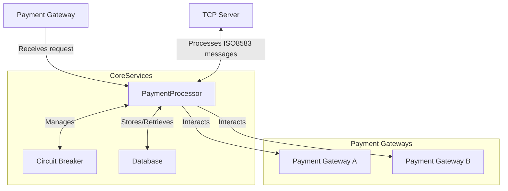
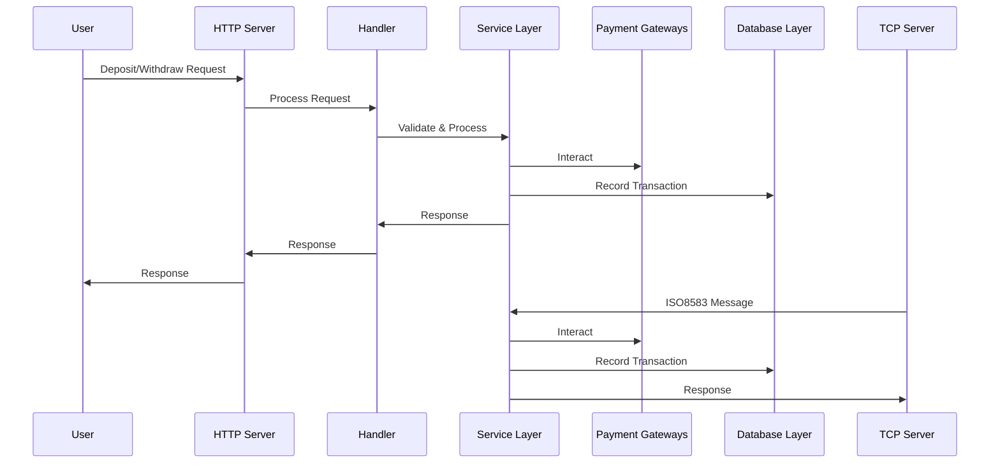

# Design Document for Payment Gateway Microservice

## 1. **Introduction**
   - **Purpose:** This document provides a detailed design of the payment gateway microservice, describing its architecture, components, and data flow.
   - **Scope:** The system handles payment transactions via multiple payment gateways, ensuring reliability with circuit breakers and fallback mechanisms.

## 2. **System Overview**
   - The system is designed to handle financial transactions (deposits and withdrawals) using a microservice architecture. It is capable of integrating multiple payment gateways and ensures fault tolerance through circuit breakers and fallback mechanisms.

## 3. **Architecture**

### 3.1 **High-Level Architecture**

- **Payment Gateway:** Routes accepts incoming requests for cash in / cash out / callback 
- **Payment Processor:** Core service that handles transaction logic, interacts with payment gateways, and manages circuit breakers.
- **Payment Gateways (PGSA, PGSB):** External services that process transactions.
- **TCP Server:** Handles ISO8583 message-based transactions over TCP.
- **Database:** Stores transaction and wallet data.

### 3.2 **Components**

- **Handler:** Manages incoming HTTP requests and calls the service layer.
- **Service Layer:** Contains the business logic for processing payments.
- **Database Layer:** Manages in-memory storage for transactions and wallet data.
- **Logging:** Centralized logging with masking of sensitive data.
- **Circuit Breaker:** Ensures the system's resilience by preventing repeated failures.

### 3.3 **Sequence Diagram**

   - **Flow:**
     1. The user sends a deposit or withdrawal request to the HTTP server.
     2. The request is processed by the handler, which validates the input.
     3. The handler calls the service layer, which interacts with the payment gateways.
     4. The transaction is recorded as authorized, and the user receives a response.
     5. For TCP-based requests, the TCP server parses ISO8583 messages and follows a similar flow.
     6. Payment callback from the gateway is routed through the server, if transaction is approved the user wallet is deposited/withdrawn.

## 4. **Detailed Design**

### 4.1 **Handler Layer**
   - **Responsibilities:**
     - Receive HTTP requests for deposit, withdrawal, and callback.
     - Validate requests and forward them to the service layer.
     - Handle errors and send appropriate HTTP responses.

### 4.2 **Service Layer**
   - **Responsibilities:**
     - Implement business logic for transaction processing.
     - Integrate with payment gateways and handle fallback mechanisms.
     - Maintain transaction states and update wallets.
     - Manage circuit breakers to ensure system resilience.

### 4.3 **Database Layer**
   - **Responsibilities:**
     - Store wallet and transaction data in an in-memory database.
     - Provide thread-safe access to data using mutexes.

### 4.4 **Payment Gateways**
   - **PGSA:** A JSON-over-HTTP based payment gateway.
   - **PGB:** A SOAP/XML-based payment gateway.
   - **Fallback Mechanism:** The system attempts to process transactions with PGSA first, and if it fails, it falls back to PGB.

### 4.5 **Circuit Breaker**
   - **Responsibilities:**
     - Monitor payment gateway responses.
     - Open the circuit if a predefined number of failures occur.
     - Retry the operation after a timeout, allowing the gateway to recover.

### 4.6 **Logging**
   - **Responsibilities:**
     - Log all incoming requests and responses.
     - Mask sensitive data before logging.
     - Provide different logging levels based on the environment (debug, info, warn, error).

